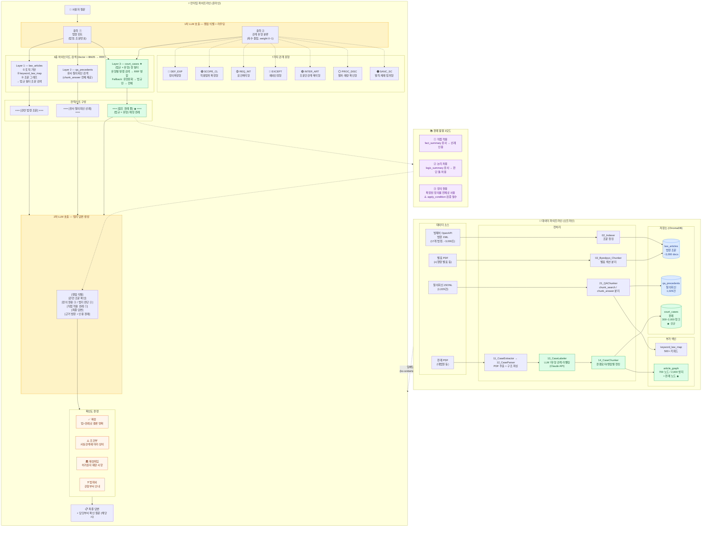

# 건축법규 검토 RAG 시스템 — 전체 구조 다이어그램

---

## 핵심 설계 원칙

| 원칙 | 내용 |
|------|------|
| **(법규 × 유형) 쌍** | 판례 검색의 핵심 키 — 같은 법규를 같은 방식으로 해석한 판례를 찾는다 |
| **복수 유형 중첩** | 하나의 질문이 N개 유형에 중첩 가능 → weight ≥ 0.5만 필터, 나머지는 부스트 |
| **Fallback 3단계** | 유형 필터 완화 → 법규만 → 전체 검색 (초기 판례 데이터 부족 대비) |
| **확신도 4단계** | 확정 / 조건부 / 재량위임 / 범위외 — 모호한 경우 구체적 확인 질문 생성 |
| **판례 활용 3모드** | ① 직접 적용 (fact) ② 논리 차용 (logic) ③ 정의 원용 (condition 검증 필수) |
